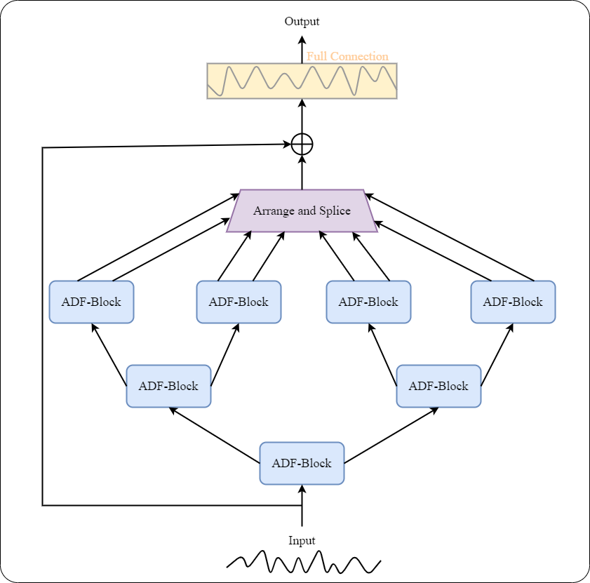
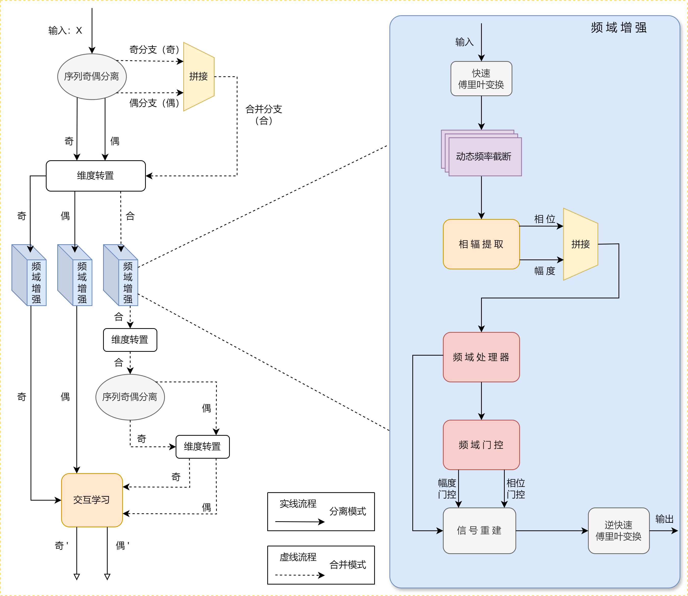

# ADFNet
## ADFNet——基于自适应双模式频域增强的时间序列预测网络。
现有时序预测方法中频域方法受限于固定的频域处理模式以及对频域信号的相位与幅度信息解耦不足，难以适应多变量任务中复杂的频率特性与跨维度依赖，且现有方法大多无法根据数据集特性自适应调整参数，导致模型泛化能力不足。为此，提出了一种自适应双模式频域增强的时间序列预测网络 (Adaptive Dual-Mode Frequency Domain Enhancement Network，ADFNet)。（1）ADFNet引入了双模式频域增强模块到样本卷积交互网络 (Sample Convolutional and Interactional Network，SCINet) 中：“分离模式”下，该模块对单独时序数据进行频域增强，此时会有频域门控机制生成互补的幅度和相位门控调整频域信号的幅度和相位信息；“合并模式”时，该模块将时序数据合并来实现多时间尺度的特征融合，并对合并数据进行频域增强来建模跨变量依赖，此时门控机制生成相互独立的幅度和相位门控来调制频域信号。（2）ADFNet设计了数据驱动的自适应参数调优体系，该体系利用贝叶斯算法和网格搜索根据时序数据特性对频域增强网络进行参数调优，来提升模型的性能和泛化能力。最后，在6个公开数据集上进行了实验。相比于SCINet，ADFNet在汇率数据集Exchange预测任务上的均方误差(MSE)和平均绝对误差(MAE)平均降低了约18.27%和8.87%。

---
# ADFNet

---
# ADF-Block

***

1）您可以在exp文件夹下见到各数据集的运行脚本（参数文件），为了尽量保证可复现性，您可以将其中的参数复制到run.py文件的相应位置。

2）models文件夹下是ADFNet（SCINet.py）的网络模型。

3）需要根据您的文件路径修改run.py和experiments文件夹下的exp.py的相关路径（这是相当简单的事）。

4）torch版本为2.0.0，python版本为3.8，需要安装的依赖可见requirements.txt，安装包的命令如下（将packname替换为所需安装的包即可）：{pip install  -i https://pypi.tuna.tsinghua.edu.cn/simple packname}